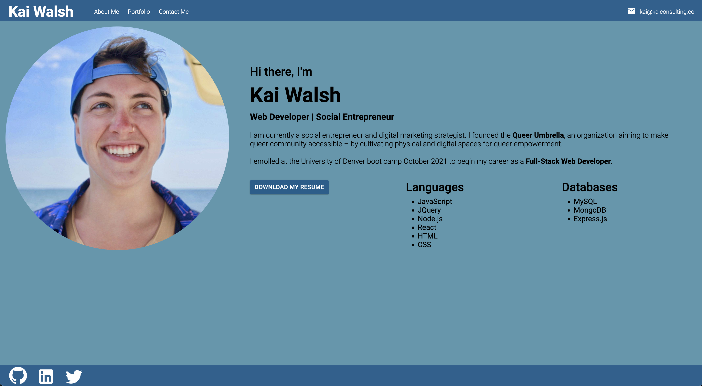

# React Portfolio

## Description
Single-page portfolio application built with React.

## Available Scripts

Install necessary packages:
`npm i`

Run the app:

### `npm start`

## Credits
Used previous project coRank for media queries and used in-class activities for forms. Referenced youtube video for styling purposes.
[video](https://www.youtube.com/watch?v=7WwtzsSHdpI)

[portfolio link]()
